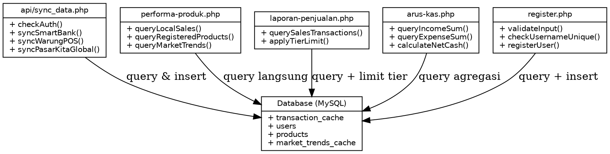
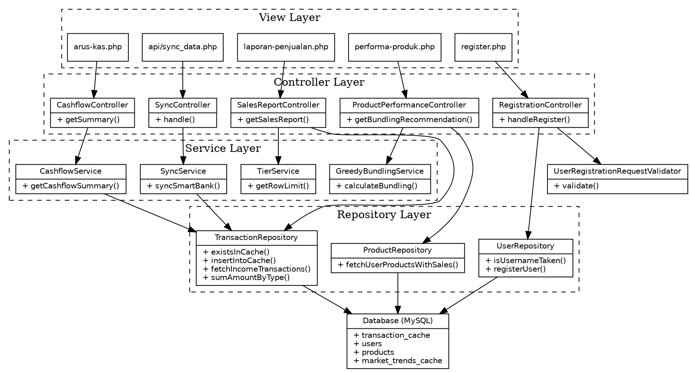

**LAPORAN ANALISIS DAN REFACTORING KODE**

**Praktikum Rekayasa Perangkat Lunak 2**

*Studi Kasus Aplikasi: UMKM Insight*

# 1. Identitas Proyek

Tabel berikut menjelaskan identitas umum dari proyek yang dianalisis dan direfactor dalam laporan ini.

<table><thead><tr><th><p><strong>Atribut</strong></p></th><th><p><strong>Keterangan</strong></p></th></tr></thead><tbody><tr><td><p>Nama Aplikasi</p></td><td><p>UMKM Insight</p></td></tr><tr><td><p>Jenis Aplikasi</p></td><td><p>Aplikasi Web (Web Application)</p></td></tr><tr><td><p>Pola Arsitektur Awal</p></td><td><p>PHP Native Prosedural (Smart UI / Big Fat Page)</p></td></tr><tr><td><p>Pola Arsitektur Tujuan</p></td><td><p>MVC (Model-View-Controller) dengan lapisan Service dan Repository (Service-Repository Pattern)</p></td></tr><tr><td><p>Topik Praktikum</p></td><td><p>MVC, Prinsip SOLID, Clean Code, High Cohesion, Low Coupling, dan Refactoring</p></td></tr><tr><td><p>Mata Kuliah</p></td><td><p>Rekayasa Perangkat Lunak 2</p></td></tr><tr><td><p>Nama Anggota Kelompok</p></td><td><p>_______________________________________</p></td></tr><tr><td><p>NIM</p></td><td><p>_______________________________________</p></td></tr><tr><td><p>Kelas / Kelompok</p></td><td><p>_______________________________________</p></td></tr><tr><td><p>Tanggal Penyusunan</p></td><td><p>_______________________________________</p></td></tr></tbody></table>

# 2. Deskripsi Singkat Aplikasi

UMKM Insight adalah sebuah platform analitik bisnis yang dirancang khusus untuk membantu pelaku Usaha Mikro, Kecil, dan Menengah (UMKM) dalam memantau dan menganalisis performa usahanya secara terpusat. Aplikasi ini mengintegrasikan data dari tiga sumber simulasi yang merepresentasikan kebutuhan nyata UMKM sehari-hari, sehingga pemilik usaha dapat mengambil keputusan bisnis berdasarkan data (data-driven decision making), bukan hanya berdasarkan intuisi.

Aplikasi ini mengandalkan tiga simulator API eksternal sebagai sumber data utama, yaitu:

- SmartBank — mensimulasikan data transaksi keuangan dan arus kas (cashflow) seperti pemasukan dan pengeluaran usaha.
- WarungPOS — mensimulasikan data transaksi kasir lokal (Point of Sale), termasuk data penjualan produk dan stok barang.
- PasarKita — mensimulasikan data tren pasar, seperti harga komoditas dan permintaan produk di pasar sekitar.

Adapun fitur-fitur utama yang disediakan oleh UMKM Insight antara lain:

- Dashboard ringkasan performa bisnis secara keseluruhan.
- Laporan Penjualan dengan pembatasan akses berdasarkan tingkatan pengguna (tier Free dan Premium).
- Analisis Performa Produk, termasuk rekomendasi paket diskon cuci gudang menggunakan pendekatan algoritma Greedy.
- Laporan Arus Kas (Cashflow) yang menghitung selisih antara pemasukan dan pengeluaran (Net Cash).
- Sinkronisasi data otomatis dari simulator eksternal ke basis data lokal (caching) melalui endpoint API internal.

Saat ini, aplikasi dibangun menggunakan PHP Native tanpa framework, basis data MySQL, styling menggunakan Tailwind CSS melalui CDN, dan visualisasi grafik menggunakan Chart.js.

# 3. Tujuan Refactoring

Refactoring terhadap aplikasi UMKM Insight dilakukan dengan tujuan-tujuan sebagai berikut:

1. Meningkatkan maintainability (kemudahan pemeliharaan) kode dengan memisahkan tanggung jawab antara presentasi (view), logika bisnis (service), dan akses data (repository), sehingga setiap perubahan pada satu lapisan tidak memengaruhi lapisan lain secara langsung.
2. Memindahkan logika bisnis inti, khususnya Algoritma Greedy Bundling pada halaman performa produk, dari sisi klien (JavaScript/Chart.js) ke sisi backend (PHP), agar logika tersebut dapat diuji, diaudit, dan digunakan kembali (reusable) oleh modul lain seperti API atau aplikasi mobile di masa depan.
3. Memisahkan query basis data dan aturan bisnis (seperti pembatasan tier Free/Premium dan perhitungan arus kas) dari kode HTML pada file view, sehingga tampilan menjadi lebih bersih dan mudah dibaca.
4. Menerapkan prinsip-prinsip SOLID dan Clean Code agar kode lebih mudah diuji (testable), lebih mudah dikembangkan (extensible), dan mengurangi duplikasi logika (DRY).
5. Mempersiapkan arsitektur aplikasi agar lebih siap untuk berkembang, misalnya jika ke depannya dibutuhkan REST API terpisah atau aplikasi mobile pendamping.

# 4. Ruang Lingkup Analisis Kode

Analisis pada laporan ini difokuskan pada lima modul/file yang dianggap paling merepresentasikan masalah arsitektur Smart UI pada aplikasi UMKM Insight. Berikut adalah tabel ruang lingkup analisis.

<table><thead><tr><th><p><strong>No</strong></p></th><th><p><strong>Modul / File</strong></p></th><th><p><strong>Metode Analisis</strong></p></th><th><p><strong>Alasan Dipilih</strong></p></th></tr></thead><tbody><tr><td><p>1</p></td><td><p>api/sync_data.php</p></td><td><p>Code review manual &amp; tracing alur data</p></td><td><p>Berisi banyak tanggung jawab sekaligus (validasi, cache check, konversi data, query) dalam satu file API.</p></td></tr><tr><td><p>2</p></td><td><p>performa-produk.php (+ app.js)</p></td><td><p>Code review manual &amp; analisis pemisahan layer</p></td><td><p>Logika bisnis inti (Algoritma Greedy) berada di sisi client, melanggar prinsip pemisahan layer.</p></td></tr><tr><td><p>3</p></td><td><p>laporan-penjualan.php</p></td><td><p>Code review manual &amp; analisis SOLID</p></td><td><p>Logika pembatasan akses tier tercampur langsung dengan query dan HTML.</p></td></tr><tr><td><p>4</p></td><td><p>arus-kas.php</p></td><td><p>Code review manual &amp; analisis cohesion/coupling</p></td><td><p>Perhitungan agregasi keuangan (SUM, Net Cash) dilakukan langsung pada file presentasi.</p></td></tr><tr><td><p>5</p></td><td><p>register.php</p></td><td><p>Code review manual &amp; analisis validasi input</p></td><td><p>Proses validasi, pengecekan data, hashing, dan penyimpanan data menyatu dalam satu file view.</p></td></tr></tbody></table>

# 5. Struktur Folder Aplikasi

## 5.1 Struktur Folder Sebelum Refactoring

Berikut adalah struktur folder aktual aplikasi UMKM Insight sebelum dilakukan refactoring. Tampak bahwa folder controllers/ dan models/ masih kosong, sedangkan seluruh logika berada langsung pada file di folder root.

UMKM-Insight/

|-- api/

|   -- sync\_data.php        (sync data dari simulator API ke cache DB)

|-- assets/

|   |-- css/style.css

|   -- js/app.js             (berisi Algoritma Greedy Bundling)

|-- config/

|   -- db.php                (koneksi PDO singleton)

|-- controllers/

|   -- .gitkeep              (kosong)

|-- models/

|   -- .gitkeep              (kosong)

|-- includes/

|   |-- header.php

|   |-- sidebar.php

|   |-- footer.php

|   |-- topbar.php

|   -- auth.php

|-- simulators/                (simulator API eksternal)

|-- index.php

|-- dashboard.php

|-- performa-produk.php

|-- laporan-penjualan.php

|-- arus-kas.php

|-- login.php

-- register.php

## 5.2 Struktur Folder Setelah Refactoring

Struktur folder berikut diusulkan agar aplikasi mengikuti pola arsitektur berlapis (Controller - Service - Repository - Validator), sehingga tanggung jawab setiap bagian kode menjadi lebih jelas dan terpisah.

UMKM-Insight/

|-- app/

|   |-- Controllers/

|   |   |-- SyncController.php

|   |   |-- ProductPerformanceController.php

|   |   |-- SalesReportController.php

|   |   |-- CashflowController.php

|   |   -- RegistrationController.php

|   |-- Services/

|   |   |-- SyncService.php

|   |   |-- GreedyBundlingService.php

|   |   |-- TierService.php

|   |   -- CashflowService.php

|   |-- Repositories/

|   |   |-- TransactionRepository.php

|   |   -- UserRepository.php

|   |-- Models/

|   |   |-- Transaction.php

|   |   |-- Product.php

|   |   -- User.php

|   -- Validators/

|       -- UserRegistrationRequestValidator.php

|-- api/

|   -- sync\_data.php        (hanya entry point, memanggil SyncController)

|-- assets/

|   |-- css/style.css

|   -- js/app.js             (hanya render chart, tanpa logika bisnis)

|-- config/

|   -- db.php

|-- includes/

|   |-- header.php

|   |-- sidebar.php

|   |-- footer.php

|   |-- topbar.php

|   -- auth.php

|-- simulators/

|-- index.php

|-- dashboard.php

|-- performa-produk.php        (view murni, memanggil Controller)

|-- laporan-penjualan.php      (view murni, memanggil Controller)

|-- arus-kas.php               (view murni, memanggil Controller)

|-- login.php

-- register.php              (view murni, memanggil Controller)

# 6. Ringkasan Arsitektur MVC

Setelah refactoring, alur kerja (data flow) aplikasi UMKM Insight mengikuti pola berlapis sebagai berikut:

6. Request — Pengguna mengakses sebuah halaman atau endpoint, misalnya membuka halaman laporan-penjualan.php atau memanggil api/sync\_data.php.
7. Controller — Permintaan diterima oleh Controller terkait (contoh: SalesReportController). Controller bertugas menerima input, memanggil Service yang sesuai, lalu meneruskan hasilnya ke View. Controller tidak boleh berisi query SQL atau logika bisnis.
8. Service — Lapisan ini menyimpan logika bisnis murni, misalnya GreedyBundlingService untuk menghitung rekomendasi bundling, TierService untuk menentukan batas akses, dan CashflowService untuk menghitung Net Cash. Service memanggil Repository untuk mengambil data, tanpa mengetahui detail teknis database.
9. Repository — Lapisan ini bertanggung jawab penuh atas akses data ke database (query SQL), misalnya TransactionRepository dan UserRepository. Dengan begitu, jika suatu saat struktur tabel berubah, perubahan cukup dilakukan di Repository tanpa menyentuh Service atau Controller.
10. View — Lapisan presentasi (file .php di root) hanya bertugas menampilkan data yang sudah diproses oleh Controller, tanpa melakukan query atau perhitungan apa pun.

Secara ringkas, alur datanya dapat digambarkan sebagai berikut:

Request -> Controller -> Service -> Repository -> Database

|

v

(data diproses)

|

v

View (HTML)

# 7. Daftar Temuan Masalah Kode

Berikut adalah ringkasan lima temuan masalah utama yang ditemukan pada kode aplikasi UMKM Insight sebelum refactoring.

<table><thead><tr><th><p><strong>No</strong></p></th><th><p><strong>Nama File</strong></p></th><th><p><strong>Masalah</strong></p></th><th><p><strong>Prinsip yang Dilanggar</strong></p></th><th><p><strong>Dampak</strong></p></th></tr></thead><tbody><tr><td><p>1</p></td><td><p>api/sync_data.php</p></td><td><p>Validasi session, cache check, konversi data, dan query tercampur dalam satu file</p></td><td><p>SRP (Single Responsibility Principle)</p></td><td><p>Sulit diuji modular dan rentan error jika struktur tabel cache berubah</p></td></tr><tr><td><p>2</p></td><td><p>performa-produk.php / app.js</p></td><td><p>Algoritma Greedy Bundling dijalankan di sisi client (JavaScript)</p></td><td><p>Separation of Concerns, Low Coupling</p></td><td><p>Logika bisnis bocor ke frontend dan tidak reusable untuk API/mobile</p></td></tr><tr><td><p>3</p></td><td><p>laporan-penjualan.php</p></td><td><p>Query SQL dan aturan limitasi tier tercampur dengan kode HTML</p></td><td><p>High Cohesion, SRP</p></td><td><p>Logika bisnis tier terikat erat dengan kode presentasi</p></td></tr><tr><td><p>4</p></td><td><p>arus-kas.php</p></td><td><p>Perhitungan SUM dan Net Cash dilakukan langsung di file view</p></td><td><p>SRP, Testability</p></td><td><p>Kode presentasi kotor dan tidak bisa diuji unit tanpa memuat HTML</p></td></tr><tr><td><p>5</p></td><td><p>register.php</p></td><td><p>Validasi input, pengecekan unik, hashing, dan INSERT menyatu dalam satu file</p></td><td><p>SRP, DRY</p></td><td><p>Duplikasi logika jika ada jalur registrasi lain (API/Mobile)</p></td></tr></tbody></table>

# 8. Analisis Before-After Refactoring

Bagian ini membahas secara rinci kelima temuan masalah kode, lengkap dengan potongan kode sebelum dan sesudah refactoring, penjelasan prinsip yang dilanggar, strategi perbaikan, dan dampak yang dihasilkan.

## 8.1 Temuan 1 — Logika Sinkronisasi Data Prosedural

**Lokasi kode: api/sync\_data.php**

**Kode Sebelum Refactoring:**

```php
<?php
// api/sync_data.php
require_once '../config/db.php';
require_once '../includes/auth.php';

header('Content-Type: application/json');

if (!isLoggedIn() || $_SESSION['role'] !== 'client') {
    echo json_encode(['status' => 'error', 'message' => 'Unauthorized']);
    exit;
}

$user = getCurrentUser($pdo);
$userId = $user['id'];
$smartbankId = $user['smartbank_id'];
$warungposId = $user['warungpos_id'];

if (!$smartbankId && !$warungposId) {
    echo json_encode(['status' => 'error', 'message' => 'Belum ada API yang terhubung.']);
    exit;
}

try {
    $syncedSources = [];
    if ($smartbankId) {
        $stmt = $pdo->prepare("SELECT id, type, amount, description, transaction_date FROM smartbank_transactions WHERE smartbank_id = ?");
        $stmt->execute([$smartbankId]);
        $sbTransactions = $stmt->fetchAll();

        foreach ($sbTransactions as $trx) {
            $extId = 'SB-' . $trx['id'];
            $check = $pdo->prepare("SELECT id FROM transaction_cache WHERE user_id = ? AND external_id = ? AND source = 'SmartBank'");
            $check->execute([$userId, $extId]);
            if (!$check->fetch()) {
                $ins = $pdo->prepare("INSERT INTO transaction_cache (user_id, external_id, source, type, amount, transaction_date, description) VALUES (?, ?, 'SmartBank', ?, ?, ?, ?)");
                $ins->execute([$userId, $extId, $trx['type'], $trx['amount'], $trx['transaction_date'], $trx['description']]);
            }
        }
        $syncedSources[] = 'SmartBank';
    }
    // Sync WarungPOS & PasarKita...
    echo json_encode(['status' => 'success', 'message' => 'Data berhasil disinkronisasi']);
} catch (Exception $e) {
    echo json_encode(['status' => 'error', 'message' => $e->getMessage()]);
}
```

**Penjelasan Masalah & Prinsip yang Dilanggar:**
- **Single Responsibility Principle (SRP)**: File `sync_data.php` menangani validasi autentikasi user, penarikan data dari database simulator, logika pemfilteran duplikasi data cache, pembersihan data lama, dan penyisipan data baru.
- **Ketergantungan Tinggi (Coupling)**: API berinteraksi langsung dengan database global `$pdo` dan sesi global `$_SESSION`, membuatnya tidak bisa dites secara modular.
- **Clean Code (Duplikasi & Keterbacaan)**: Logika untuk melakukan pengecekan duplikasi cache dan query insert diulang untuk setiap sumber API (SmartBank & WarungPOS).

**Strategi Perbaikan:**
- Memisahkan akses database transaksi ke dalam `TransactionRepository`.
- Memisahkan logika penarikan dan sinkronisasi data ke dalam `SyncService`.
- Mengarahkan `api/sync_data.php` sebagai entry-point tipis yang memanggil `SyncController`.

**Kode Sesudah Refactoring:**

```php
// app/Repositories/TransactionRepository.php
class TransactionRepository
{
    private PDO $db;

    public function __construct(PDO $db) {
        $this->db = $db;
    }

    public function existsInCache(int $userId, string $externalId, string $source): bool {
        $stmt = $this->db->prepare("SELECT id FROM transaction_cache WHERE user_id = ? AND external_id = ? AND source = ?");
        $stmt->execute([$userId, $externalId, $source]);
        return (bool)$stmt->fetch();
    }

    public function insertIntoCache(int $userId, string $externalId, string $source, string $type, float $amount, string $date, string $description): void {
        $stmt = $this->db->prepare("INSERT INTO transaction_cache (user_id, external_id, source, type, amount, transaction_date, description) VALUES (?, ?, ?, ?, ?, ?, ?)");
        $stmt->execute([$userId, $externalId, $source, $type, $amount, $date, $description]);
    }

    public function fetchSmartBankTransactions(string $smartbankId): array {
        $stmt = $this->db->prepare("SELECT id, type, amount, description, transaction_date FROM smartbank_transactions WHERE smartbank_id = ?");
        $stmt->execute([$smartbankId]);
        return $stmt->fetchAll(PDO::FETCH_ASSOC);
    }
}

// app/Services/SyncService.php
class SyncService
{
    private TransactionRepository $repository;

    public function __construct(TransactionRepository $repository) {
        $this->repository = $repository;
    }

    public function syncSmartBank(int $userId, string $smartbankId): int {
        $transactions = $this->repository->fetchSmartBankTransactions($smartbankId);
        $count = 0;
        foreach ($transactions as $trx) {
            $extId = 'SB-' . $trx['id'];
            if (!$this->repository->existsInCache($userId, $extId, 'SmartBank')) {
                $this->repository->insertIntoCache($userId, $extId, 'SmartBank', $trx['type'], $trx['amount'], $trx['transaction_date'], $trx['description']);
                $count++;
            }
        }
        return $count;
    }
}

// app/Controllers/SyncController.php
class SyncController
{
    private SyncService $syncService;

    public function __construct(SyncService $syncService) {
        $this->syncService = $syncService;
    }

    public function handle(int $userId, ?string $smartbankId, ?string $warungposId): array {
        $synced = [];
        if ($smartbankId) {
            $count = $this->syncService->syncSmartBank($userId, $smartbankId);
            if ($count > 0) $synced[] = 'SmartBank';
        }
        return ['status' => 'success', 'synced' => $synced];
    }
}

// api/sync_data.php (Entry Point)
require_once '../config/db.php';
require_once '../includes/auth.php';
require_once '../app/Repositories/TransactionRepository.php';
require_once '../app/Services/SyncService.php';
require_once '../app/Controllers/SyncController.php';

header('Content-Type: application/json');

if (!isLoggedIn() || $_SESSION['role'] !== 'client') {
    echo json_encode(['status' => 'error', 'message' => 'Unauthorized']);
    exit;
}

$user = getCurrentUser($pdo);
$repository = new TransactionRepository($pdo);
$service = new SyncService($repository);
$controller = new SyncController($service);

$result = $controller->handle($user['id'], $user['smartbank_id'], $user['warungpos_id']);
echo json_encode($result);
```

**Dampak Perbaikan:**

- SyncService kini dapat diuji secara unit testing tanpa perlu memuat session atau koneksi HTTP.
- TransactionRepository dapat digunakan kembali oleh fitur lain yang juga membutuhkan akses ke tabel cache\_transactions, misalnya CashflowService.
- Jika struktur tabel berubah, cukup ubah TransactionRepository tanpa menyentuh logika bisnis sinkronisasi.

## 8.2 Temuan 2 — Algoritma Greedy Bundling di Client-side JavaScript

**Lokasi kode: performa-produk.php dan assets/js/app.js**

**Kode Sebelum Refactoring:**

```php
<!-- performa-produk.php (Sebelum Refactoring) -->
<script>
    const allProducts = <?php echo json_encode($allProducts); ?>;
    
    // GREEDY ALGORITHM: OPTIMALISASI BUNDLING CUCI GUDANG
    if (allProducts && allProducts.length >= 2) {
        // 1. Data Pipeline & Perhitungan Rasio kemandekan
        const productsData = allProducts.map(p => ({
            name: p.nama_produk,
            stock: parseInt(p.stok) || 0,
            sold: parseInt(p.total_sold) || 0,
            ratio: (parseInt(p.total_sold) || 0) === 0 ? (parseInt(p.stok) || 0) * 1000 : (parseInt(p.stok) || 0) / parseInt(p.total_sold)
        }));

        // 2. Greedy Sort 1 & 2: Urutkan berdasarkan kemandekan (dead stock) dan terlaris (best seller)
        const deadStockList = [...productsData].sort((a, b) => b.ratio - a.ratio);
        const bestSellerList = [...productsData].sort((a, b) => b.sold - a.sold);

        // 3. Greedy Select: Hubungkan produk paling mandek dengan paling laris
        let topDead = deadStockList[0];
        let topBest = bestSellerList[0];

        if (topDead.name === topBest.name && bestSellerList.length > 1) {
            topBest = bestSellerList[1];
        }

        // 4. Dorong rekomendasi ke dashboard
        if (topDead.stock > 0 && topBest.sold > 0) {
            insights.push({
                l: 'Rekomendasi Bundling (Greedy Analysis)',
                v: `"${topDead.name}" menumpuk di gudang (Stok: ${topDead.stock}). Gabungkan dengan "${topBest.name}" (Terlaris) sebagai paket diskon cuci gudang!`,
            });
        }
    }
</script>
```

**Penjelasan Masalah & Prinsip yang Dilanggar:**
- **Separation of Concerns (SoC)**: Logika bisnis komputasi Algoritma Greedy untuk rekomendasi bundling produk diletakkan di sisi frontend (Client-side JavaScript). Ini melanggar batas tanggung jawab antara presentasi dan logika bisnis.
- **Reusability Rendah**: Algoritma Greedy ini tidak bisa digunakan oleh modul backend lain (misal notifikasi email otomatis, laporan cetak PDF, atau REST API untuk aplikasi mobile) tanpa menulis ulang logika yang sama di JavaScript.
- **Clean Code & Security**: Data mentah stok dan kuantitas penjualan dikirim seluruhnya ke sisi browser klien, dan logika algoritma terekspos di browser sehingga dapat dimanipulasi dengan mudah.

**Strategi Perbaikan:**
- Memindahkan Algoritma Greedy ke backend PHP dalam sebuah service bernama `GreedyBundlingService`.
- Controller mengambil produk dari repository, meneruskannya ke Service untuk diproses secara Greedy, lalu mengirimkan hasil rekomendasi yang sudah jadi ke halaman View PHP untuk dirender.

**Kode Sesudah Refactoring:**

```php
// app/Services/GreedyBundlingService.php
class GreedyBundlingService
{
    public function calculateBundling(array $allProducts): ?array
    {
        if (count($allProducts) < 2) {
            return null;
        }

        $productsData = array_map(function ($p) {
            $stock = (int)($p['stok'] ?? 0);
            $sold = (int)($p['total_sold'] ?? 0);
            return [
                'name' => $p['nama_produk'],
                'stock' => $stock,
                'sold' => $sold,
                'ratio' => $sold === 0 ? $stock * 1000 : $stock / $sold
            ];
        }, $allProducts);

        // Greedy Sort: Urutkan Dead Stock (rasio tinggi) & Best Seller (sold tinggi)
        $deadStockList = $productsData;
        usort($deadStockList, fn($a, $b) => $b['ratio'] <=> $a['ratio']);

        $bestSellerList = $productsData;
        usort($bestSellerList, fn($a, $b) => $b['sold'] <=> $a['sold']);

        $topDead = $deadStockList[0];
        $topBest = $bestSellerList[0];

        if ($topDead['name'] === $topBest['name'] && count($bestSellerList) > 1) {
            $topBest = $bestSellerList[1];
        }

        if ($topDead['stock'] > 0 && $topBest['sold'] > 0) {
            return [
                'dead_product' => $topDead['name'],
                'best_product' => $topBest['name'],
                'dead_stock' => $topDead['stock'],
                'best_sold' => $topBest['sold'],
                'recommendation' => "Bundling '{$topDead['name']}' (Stok: {$topDead['stock']}) dengan '{$topBest['name']}' (Terlaris) untuk mempercepat cuci gudang."
            ];
        }

        return null;
    }
}

// app/Controllers/ProductPerformanceController.php
class ProductPerformanceController
{
    private ProductRepository $productRepo;
    private GreedyBundlingService $bundlingService;

    public function __construct(ProductRepository $productRepo, GreedyBundlingService $bundlingService) {
        $this->productRepo = $productRepo;
        $this->bundlingService = $bundlingService;
    }

    public function getBundlingRecommendation(int $userId): ?array {
        $products = $this->productRepo->fetchUserProductsWithSales($userId);
        return $this->bundlingService->calculateBundling($products);
    }
}

// performa-produk.php (View)
$recommendation = $controller->getBundlingRecommendation($userId);
?>
<script>
    // Frontend hanya merender hasil jadi dari backend PHP
    const bundlingRecommendation = <?php echo json_encode($recommendation); ?>;
    if (bundlingRecommendation) {
        insights.push({
            l: 'Rekomendasi Bundling (Greedy Analysis)',
            v: bundlingRecommendation.recommendation,
            c: 'text-purple-600', bg: 'bg-purple-100 dark:bg-purple-900/50', i: 'ph-gift'
        });
    }
</script>
```

**Dampak Perbaikan:**

- GreedyBundlingService dapat diuji secara unit testing dengan data dummy tanpa memerlukan browser sama sekali.
- Logika bisnis kini dapat digunakan kembali oleh REST API atau aplikasi mobile tanpa duplikasi kode.
- JavaScript di sisi client menjadi jauh lebih sederhana karena hanya bertugas merender data, bukan menghitungnya.

## 8.3 Temuan 3 — Query Database & Aturan Tier Tercampur di View

**Lokasi kode: laporan-penjualan.php**

**Kode Sebelum Refactoring:**

```php
<?php
// laporan-penjualan.php (Sebelum Refactoring)
require_once 'config/db.php';
require_once 'includes/auth.php';

$user = getCurrentUser($pdo);
$userId = $user['id'];
$isPremium = $user['tier'] === 'premium';

// Logika pembatasan tier & Query SQL langsung di View
$query = "SELECT * FROM transaction_cache WHERE user_id = ? AND type = 'Income' ORDER BY transaction_date DESC";
if (!$isPremium) {
    $query .= " LIMIT 10"; // Akun Free dibatasi 10 transaksi pendapatan terakhir
}
$stmt = $pdo->prepare($query);
$stmt->execute([$userId]);
$salesTransactions = $stmt->fetchAll();
?>

<!-- Render tabel HTML langsung dari variabel $salesTransactions -->
<?php foreach($salesTransactions as $t): ?>
    <tr>
        <td><?php echo $t['external_id']; ?></td>
        <td><?php echo date('d M Y', strtotime($t['transaction_date'])); ?></td>
        <td><?php echo $t['type']; ?></td>
        <td><?php echo $t['source']; ?></td>
        <td><?php echo formatRupiah($t['amount']); ?></td>
    </tr>
<?php endforeach; ?>
```

**Penjelasan Masalah & Prinsip yang Dilanggar:**
- **High Cohesion (Kepaduan Modul)**: File `laporan-penjualan.php` memikul tanggung jawab presentasi (HTML/UI), otorisasi bisnis (aturan tier Free/Premium), dan query data mentah sekaligus.
- **Single Responsibility Principle (SRP)**: Jika aturan pembatasan baris untuk akun Free diubah (misalnya menjadi 15 transaksi), pengembang terpaksa harus mengubah file presentasi HTML.
- **Keterikatan Tinggi (Coupling)**: File UI sangat terikat erat dengan skema basis data `transaction_cache`, menyulitkan migrasi database di masa mendatang.

**Strategi Perbaikan:**
- Memisahkan akses database transaksi ke dalam `TransactionRepository`.
- Memisahkan validasi/logika pembatasan tier ke dalam `TierService`.
- Menggunakan `SalesReportController` untuk mengoordinasikan pengambilan data sesuai tier pengguna.

**Kode Sesudah Refactoring:**

```php
// app/Services/TierService.php
class TierService
{
    private const FREE_LIMIT = 10;

    public function getRowLimit(string $tier): ?int {
        return $tier === 'premium' ? null : self::FREE_LIMIT;
    }
}

// app/Repositories/TransactionRepository.php
class TransactionRepository
{
    private PDO $db;

    public function __construct(PDO $db) {
        $this->db = $db;
    }

    public function fetchIncomeTransactions(int $userId, ?int $limit = null): array {
        $sql = "SELECT * FROM transaction_cache WHERE user_id = :user_id AND type = 'Income' ORDER BY transaction_date DESC";
        if ($limit !== null) {
            $sql .= " LIMIT :limit";
        }
        $stmt = $this->db->prepare($sql);
        $stmt->bindValue(':user_id', $userId, PDO::PARAM_INT);
        if ($limit !== null) {
            $stmt->bindValue(':limit', $limit, PDO::PARAM_INT);
        }
        $stmt->execute();
        return $stmt->fetchAll(PDO::FETCH_ASSOC);
    }
}

// app/Controllers/SalesReportController.php
class SalesReportController
{
    private TransactionRepository $repository;
    private TierService $tierService;

    public function __construct(TransactionRepository $repository, TierService $tierService) {
        $this->repository = $repository;
        $this->tierService = $tierService;
    }

    public function getSalesReport(int $userId, string $tier): array {
        $limit = $this->tierService->getRowLimit($tier);
        return $this->repository->fetchIncomeTransactions($userId, $limit);
    }
}

// laporan-penjualan.php (View)
$controller = new SalesReportController($transactionRepo, $tierService);
$salesTransactions = $controller->getSalesReport($userId, $user['tier']);
?>
<!-- Tampilan HTML murni tanpa logika query SQL -->
<?php foreach($salesTransactions as $t): ?>
    <tr>
        <td><?= htmlspecialchars($t['external_id']) ?></td>
        <td><?= htmlspecialchars(date('d M Y', strtotime($t['transaction_date']))) ?></td>
        <td><?= htmlspecialchars($t['type']) ?></td>
        <td><?= htmlspecialchars($t['source']) ?></td>
        <td><?= htmlspecialchars(formatRupiah($t['amount'])) ?></td>
    </tr>
<?php endforeach; ?>
```

**Penjelasan Masalah & Prinsip yang Dilanggar:**

- High Cohesion tidak tercapai karena file view memiliki dua tanggung jawab yang tidak berkaitan langsung: menampilkan HTML dan menentukan aturan bisnis akses tier.
- Single Responsibility Principle dilanggar karena perubahan pada aturan tier (misalnya menambah tier baru 'Business') akan memaksa perubahan langsung pada file presentasi.
- Query SQL bercampur dengan keputusan otorisasi data, sehingga sulit diuji secara terpisah.

**Strategi Perbaikan:**

Query data dipindahkan ke TransactionRepository, sedangkan aturan penentuan batas data berdasarkan tier dipindahkan ke TierService. View hanya memanggil Controller dan menampilkan hasil akhirnya.

**Kode Sesudah Refactoring:**

<?php

// app/Services/TierService.php

class TierService

{

private const FREE\_TIER\_LIMIT = 10;

public function getRowLimitForTier(string \$userTier): ?int

{

// Mengembalikan null artinya tanpa batas (unlimited)

return \$userTier === 'free' ? self::FREE\_TIER\_LIMIT : null;

}

}

<?php

// app/Repositories/TransactionRepository.php (tambahan method)

class TransactionRepository

{

// ...method lain seperti pada Temuan 1...

public function getSalesReport(?int \$limit = null): array

{

\$sql = "SELECT trx\_date, product\_name, qty, total\_price

FROM cache\_transactions ORDER BY trx\_date DESC";

if (\$limit !== null) {

\$sql .= " LIMIT :limit";

}

\$stmt = \$this->db->prepare(\$sql);

if (\$limit !== null) {

\$stmt->bindValue(':limit', \$limit, PDO::PARAM\_INT);

}

\$stmt->execute();

return \$stmt->fetchAll(PDO::FETCH\_ASSOC);

}

}

<?php

// app/Controllers/SalesReportController.php

class SalesReportController

{

private TransactionRepository \$transactionRepository;

private TierService \$tierService;

public function \_\_construct(

TransactionRepository \$transactionRepository,

TierService \$tierService

) {

\$this->transactionRepository = \$transactionRepository;

\$this->tierService = \$tierService;

}

public function getReport(string \$userTier): array

{

\$limit = \$this->tierService->getRowLimitForTier(\$userTier);

return \$this->transactionRepository->getSalesReport(\$limit);

}

}

<?php

// laporan-penjualan.php (setelah refactoring, view murni)

require '../bootstrap.php';

AuthMiddleware::requireLogin();

\$controller = new SalesReportController(\$transactionRepository, \$tierService);

\$transactions = \$controller->getReport(\$\_SESSION['user\_tier']);

?>

<table>

<?php foreach (\$transactions as \$trx): ?>

<tr>

<td><?= htmlspecialchars(\$trx['trx\_date']) ?></td>

<td><?= htmlspecialchars(\$trx['product\_name']) ?></td>

<td><?= htmlspecialchars(\$trx['qty']) ?></td>

<td><?= htmlspecialchars(\$trx['total\_price']) ?></td>

</tr>

<?php endforeach; ?>

</table>

**Dampak Perbaikan:**

- Aturan bisnis tier kini terpusat di TierService, memudahkan penambahan tier baru tanpa mengubah file view.
- Query data dapat diuji secara independen dari aturan bisnis tier.
- View menjadi jauh lebih ringkas dan hanya berfokus pada tampilan.

## 8.4 Temuan 4 — Perhitungan Net Cash & Query Agregasi di View

**Lokasi kode: arus-kas.php**

**Kode Sebelum Refactoring:**

```php
<?php
// arus-kas.php (Sebelum Refactoring)
require_once 'config/db.php';
require_once 'includes/auth.php';

$user = getCurrentUser($pdo);
$userId = $user['id'];

// Query agregasi langsung di file view
$stmt = $pdo->prepare("SELECT SUM(amount) FROM transaction_cache WHERE user_id = ? AND type = 'Income'");
$stmt->execute([$userId]);
$totalIn = $stmt->fetchColumn() ?: 0;

$stmt = $pdo->prepare("SELECT SUM(amount) FROM transaction_cache WHERE user_id = ? AND type = 'Expense'");
$stmt->execute([$userId]);
$totalOut = $stmt->fetchColumn() ?: 0;

// Logika matematika bisnis langsung di file view
$netCash = $totalIn - $totalOut;
?>

<!-- Render output -->
<div>Total Pemasukan: <?php echo formatRupiah($totalIn); ?></div>
<div>Total Pengeluaran: <?php echo formatRupiah($totalOut); ?></div>
<div>Net Cash: <?php echo formatRupiah($netCash); ?></div>
```

**Penjelasan Masalah & Prinsip yang Dilanggar:**
- **Single Responsibility Principle (SRP)**: File `arus-kas.php` memikul tanggung jawab presentasi visual sekaligus kalkulasi finansial (Net Cash = Total In - Total Out).
- **Testability Rendah**: Logika matematika dan agregasi query tidak bisa diuji unit testing tanpa memicu rendering halaman HTML lengkap.
- **Ketergantungan Query SQL**: Perubahan tipe transaksi atau model agregasi data memaksa pengembang melakukan perubahan di tingkat file UI.

**Strategi Perbaikan:**
- Memindahkan query agregasi SUM ke `TransactionRepository`.
- Memisahkan kalkulasi finansial Net Cash ke `CashflowService`.
- Menggunakan `CashflowController` untuk menyajikan data bersih ke halaman View.

**Kode Sesudah Refactoring:**

```php
// app/Repositories/TransactionRepository.php
class TransactionRepository
{
    private PDO $db;

    public function __construct(PDO $db) {
        $this->db = $db;
    }

    public function sumAmountByType(int $userId, string $type): float {
        $stmt = $this->db->prepare("SELECT SUM(amount) FROM transaction_cache WHERE user_id = ? AND type = ?");
        $stmt->execute([$userId, $type]);
        return (float)($stmt->fetchColumn() ?: 0);
    }
}

// app/Services/CashflowService.php
class CashflowService
{
    private TransactionRepository $repository;

    public function __construct(TransactionRepository $repository) {
        $this->repository = $repository;
    }

    public function getCashflowSummary(int $userId): array {
        $totalIn = $this->repository->sumAmountByType($userId, 'Income');
        $totalOut = $this->repository->sumAmountByType($userId, 'Expense');
        return [
            'total_in' => $totalIn,
            'total_out' => $totalOut,
            'net_cash' => $totalIn - $totalOut
        ];
    }
}

// app/Controllers/CashflowController.php
class CashflowController
{
    private CashflowService $service;

    public function __construct(CashflowService $service) {
        $this->service = $service;
    }

    public function getSummary(int $userId): array {
        return $this->service->getCashflowSummary($userId);
    }
}

// arus-kas.php (View)
$controller = new CashflowController($cashflowService);
$summary = $controller->getSummary($userId);
?>
<!-- Rapor Kas Tampilan HTML -->
<div>Total Pemasukan: <?= htmlspecialchars(formatRupiah($summary['total_in'])) ?></div>
<div>Total Pengeluaran: <?= htmlspecialchars(formatRupiah($summary['total_out'])) ?></div>
<div>Net Cash: <?= htmlspecialchars(formatRupiah($summary['net_cash'])) ?></div>
```

**Penjelasan Masalah & Prinsip yang Dilanggar:**

- Single Responsibility Principle dilanggar karena file view bertugas menampilkan HTML sekaligus menghitung agregasi keuangan.
- Kode tidak dapat diuji unit testing karena perhitungan Net Cash hanya bisa dijalankan dengan memuat seluruh halaman HTML.
- Duplikasi berpotensi terjadi apabila perhitungan Net Cash juga dibutuhkan di halaman Dashboard.

**Strategi Perbaikan:**

Perhitungan agregasi keuangan dipindahkan ke CashflowService, sedangkan query SUM dipindahkan ke TransactionRepository. Dengan begitu, perhitungan Net Cash dapat dipanggil dari halaman mana pun, termasuk Dashboard, tanpa duplikasi kode.

**Kode Sesudah Refactoring:**

<?php

// app/Repositories/TransactionRepository.php (tambahan method)

class TransactionRepository

{

// ...method lain seperti pada Temuan 1 dan 3...

public function getTotalByType(string \$type): float

{

\$stmt = \$this->db->prepare(

"SELECT SUM(amount) AS total FROM cache\_transactions WHERE type = ?"

);

\$stmt->execute([\$type]);

return (float) (\$stmt->fetch(PDO::FETCH\_ASSOC)['total'] ?? 0);

}

}

<?php

// app/Services/CashflowService.php

class CashflowService

{

private TransactionRepository \$transactionRepository;

public function \_\_construct(TransactionRepository \$transactionRepository)

{

\$this->transactionRepository = \$transactionRepository;

}

public function getSummary(): array

{

\$totalIn  = \$this->transactionRepository->getTotalByType('income');

\$totalOut = \$this->transactionRepository->getTotalByType('expense');

return [

'total\_in'  => \$totalIn,

'total\_out' => \$totalOut,

'net\_cash'  => \$totalIn - \$totalOut,

];

}

}

<?php

// app/Controllers/CashflowController.php

class CashflowController

{

private CashflowService \$cashflowService;

public function \_\_construct(CashflowService \$cashflowService)

{

\$this->cashflowService = \$cashflowService;

}

public function getSummary(): array

{

return \$this->cashflowService->getSummary();

}

}

<?php

// arus-kas.php (setelah refactoring, view murni)

require '../bootstrap.php';

\$controller = new CashflowController(\$cashflowService);

\$summary = \$controller->getSummary();

?>

<div class="card">

<p>Total Pemasukan: <?= number\_format(\$summary['total\_in']) ?></p>

<p>Total Pengeluaran: <?= number\_format(\$summary['total\_out']) ?></p>

<p>Net Cash: <?= number\_format(\$summary['net\_cash']) ?></p>

</div>

**Dampak Perbaikan:**

- CashflowService dapat diuji unit testing secara terpisah dengan data dummy.
- Perhitungan Net Cash dapat dipakai ulang di halaman Dashboard tanpa menulis ulang query.
- File view menjadi sangat ringkas dan hanya menampilkan data hasil olahan.

## 8.5 Temuan 5 — Proses Registrasi & Validasi Input Prosedural

**Lokasi kode: register.php**

**Kode Sebelum Refactoring:**

```php
<?php
// register.php (Sebelum Refactoring)
require_once 'config/db.php';
require_once 'includes/auth.php';

if ($_SERVER['REQUEST_METHOD'] === 'POST') {
    $nama = sanitize($_POST['nama']);
    $email = sanitize($_POST['email']);
    $bisnis = sanitize($_POST['bisnis']);
    $username = sanitize($_POST['username']);
    $password = $_POST['password'];
    $confirm = $_POST['confirm_password'];

    if (empty($nama) || empty($email) || empty($username) || empty($password)) {
        $error = "Semua field wajib diisi.";
    } elseif ($password !== $confirm) {
        $error = "Konfirmasi password tidak cocok.";
    } else {
        // Cek username unik langsung di file view
        $stmt = $pdo->prepare("SELECT id FROM users WHERE username = ?");
        $stmt->execute([$username]);
        if ($stmt->fetch()) {
            $error = "Username sudah digunakan.";
        } else {
            $hashed = password_hash($password, PASSWORD_BCRYPT);
            
            // Query Insert langsung di file view
            $stmt = $pdo->prepare("INSERT INTO users (username, password, nama_lengkap, email, nama_bisnis, role, tier) VALUES (?, ?, ?, ?, ?, 'client', 'free')");
            if ($stmt->execute([$username, $hashed, $nama, $email, $bisnis])) {
                $success = "Registrasi berhasil!";
            } else {
                $error = "Terjadi kesalahan saat mendaftar.";
            }
        }
    }
}
?>
<!-- Tampilan form HTML di register.php -->
```

**Penjelasan Masalah & Prinsip yang Dilanggar:**
- **Single Responsibility Principle (SRP)**: File `register.php` bertindak sebagai controller (menangani input POST), validator (memeriksa format password, kelengkapan data), data access (mengecek duplikasi dan insert user ke DB), serta view (menampilkan markup HTML).
- **Prinsip DRY (Don't Repeat Yourself)**: Aturan validasi registrasi (seperti format email dan kecocokan password) terikat mati di file UI. Jika nanti ditambahkan registrasi via API mobile, aturan ini harus diduplikasi.
- **Keterbacaan Rendah (Spaghetti Code)**: Percabangan logic validasi bersarang (*nested if-else*) bercampur langsung dengan tag HTML.

**Strategi Perbaikan:**
- Membuat `UserRegistrationRequestValidator` khusus untuk validasi form input registrasi.
- Membuat `UserRepository` untuk memeriksa keunikan username dan melakukan insert data ke database `users`.
- Membuat `RegistrationController` untuk mengoordinasikan proses registrasi.

**Kode Sesudah Refactoring:**

```php
// app/Validators/UserRegistrationRequestValidator.php
class UserRegistrationRequestValidator
{
    public function validate(array $input): ?string {
        if (empty($input['nama']) || empty($input['email']) || empty($input['username']) || empty($input['password'])) {
            return "Semua field wajib diisi.";
        }
        if ($input['password'] !== ($input['confirm_password'] ?? '')) {
            return "Konfirmasi password tidak cocok.";
        }
        if (!filter_var($input['email'], FILTER_VALIDATE_EMAIL)) {
            return "Format email tidak valid.";
        }
        return null;
    }
}

// app/Repositories/UserRepository.php
class UserRepository
{
    private PDO $db;

    public function __construct(PDO $db) {
        $this->db = $db;
    }

    public function isUsernameTaken(string $username): bool {
        $stmt = $this->db->prepare("SELECT id FROM users WHERE username = ?");
        $stmt->execute([$username]);
        return (bool)$stmt->fetch();
    }

    public function registerUser(string $username, string $password, string $nama, string $email, string $bisnis): bool {
        $hashed = password_hash($password, PASSWORD_BCRYPT);
        $stmt = $this->db->prepare("INSERT INTO users (username, password, nama_lengkap, email, nama_bisnis, role, tier) VALUES (?, ?, ?, ?, ?, 'client', 'free')");
        return $stmt->execute([$username, $hashed, $nama, $email, $bisnis]);
    }
}

// app/Controllers/RegistrationController.php
class RegistrationController
{
    private UserRepository $userRepo;
    private UserRegistrationRequestValidator $validator;

    public function __construct(UserRepository $userRepo, UserRegistrationRequestValidator $validator) {
        $this->userRepo = $userRepo;
        $this->validator = $validator;
    }

    public function handleRegister(array $postData): array {
        $validationError = $this->validator->validate($postData);
        if ($validationError) {
            return ['status' => 'error', 'message' => $validationError];
        }

        if ($this->userRepo->isUsernameTaken($postData['username'])) {
            return ['status' => 'error', 'message' => "Username sudah digunakan."];
        }

        $success = $this->userRepo->registerUser(
            $postData['username'],
            $postData['password'],
            $postData['nama'],
            $postData['email'],
            $postData['bisnis']
        );

        if ($success) {
            return ['status' => 'success', 'message' => "Registrasi berhasil! Silakan login."];
        }
        return ['status' => 'error', 'message' => "Terjadi kesalahan saat mendaftar."];
    }
}

// register.php (View)
$controller = new RegistrationController($userRepo, $registrationValidator);
if ($_SERVER['REQUEST_METHOD'] === 'POST') {
    $result = $controller->handleRegister($_POST);
    if ($result['status'] === 'success') {
        $success = $result['message'];
    } else {
        $error = $result['message'];
    }
}
?>
<!-- Tampilan form murni, mengambil variabel $error / $success -->
<form method="POST">
<?php if (isset($error)) echo "<p class='error'>$error</p>"; ?>
<!-- input form di sini -->
</form>

**Penjelasan Masalah & Prinsip yang Dilanggar:**

- Single Responsibility Principle dilanggar karena satu file menangani validasi input, pengecekan data unik di database, hashing password, dan penyimpanan data sekaligus.
- DRY (Don't Repeat Yourself) berpotensi dilanggar karena jika dibutuhkan jalur registrasi lain (misalnya melalui REST API untuk aplikasi mobile), seluruh logika validasi harus ditulis ulang.
- Sulit dilakukan unit testing terhadap aturan validasi karena validasi menyatu dengan proses \$\_POST dan tampilan form.

**Strategi Perbaikan:**

Logika validasi dipecah menjadi kelas UserRegistrationRequestValidator yang murni berisi aturan validasi, sedangkan akses data pengguna dipindahkan ke UserRepository. RegistrationController menjadi penghubung antara validator, repository, dan view.

**Kode Sesudah Refactoring:**

<?php

// app/Validators/UserRegistrationRequestValidator.php

class UserRegistrationRequestValidator

{

private const MIN\_USERNAME\_LENGTH = 4;

private const MIN\_PASSWORD\_LENGTH = 8;

public function validate(array \$input): array

{

\$errors = [];

if (strlen(\$input['username'] ?? '') < self::MIN\_USERNAME\_LENGTH) {

\$errors[] = 'Username minimal ' . self::MIN\_USERNAME\_LENGTH . ' karakter';

}

if (!filter\_var(\$input['email'] ?? '', FILTER\_VALIDATE\_EMAIL)) {

\$errors[] = 'Email tidak valid';

}

if (strlen(\$input['password'] ?? '') < self::MIN\_PASSWORD\_LENGTH) {

\$errors[] = 'Password minimal ' . self::MIN\_PASSWORD\_LENGTH . ' karakter';

}

return \$errors;

}

}

<?php

// app/Repositories/UserRepository.php

class UserRepository

{

private PDO \$db;

public function \_\_construct(PDO \$db)

{

\$this->db = \$db;

}

public function usernameExists(string \$username): bool

{

\$stmt = \$this->db->prepare("SELECT id FROM users WHERE username = ?");

\$stmt->execute([\$username]);

return (bool) \$stmt->fetch();

}

public function create(string \$username, string \$email, string \$hashedPassword): void

{

\$stmt = \$this->db->prepare(

"INSERT INTO users (username, email, password, tier) VALUES (?, ?, ?, 'free')"

);

\$stmt->execute([\$username, \$email, \$hashedPassword]);

}

}

<?php

// app/Controllers/RegistrationController.php

class RegistrationController

{

private UserRegistrationRequestValidator \$validator;

private UserRepository \$userRepository;

public function \_\_construct(

UserRegistrationRequestValidator \$validator,

UserRepository \$userRepository

) {

\$this->validator = \$validator;

\$this->userRepository = \$userRepository;

}

public function register(array \$input): array

{

\$errors = \$this->validator->validate(\$input);

if (\$this->userRepository->usernameExists(\$input['username'] ?? '')) {

\$errors[] = 'Username sudah digunakan';

}

if (!empty(\$errors)) {

return ['success' => false, 'errors' => \$errors];

}

\$hashedPassword = password\_hash(\$input['password'], PASSWORD\_BCRYPT);

\$this->userRepository->create(\$input['username'], \$input['email'], \$hashedPassword);

return ['success' => true, 'errors' => []];

}

}

<?php

// register.php (setelah refactoring, view murni)

require '../bootstrap.php';

\$errors = [];

if (\$\_SERVER['REQUEST\_METHOD'] === 'POST') {

\$controller = new RegistrationController(\$validator, \$userRepository);

\$result = \$controller->register(\$\_POST);

if (\$result['success']) {

header('Location: login.php');

exit;

}

\$errors = \$result['errors'];

}

?>

<form method="POST">

<?php foreach (\$errors as \$error): ?>

<p class="error"><?= htmlspecialchars(\$error) ?></p>

<?php endforeach; ?>

<!-- input form di sini -->

</form>

**Dampak Perbaikan:**

- UserRegistrationRequestValidator dapat diuji unit testing secara terpisah tanpa memerlukan koneksi database atau form HTML.
- Logika validasi dan penyimpanan data dapat digunakan kembali jika dibutuhkan endpoint API registrasi untuk aplikasi mobile.
- File register.php menjadi jauh lebih ringkas dan mudah dibaca.

# 9. Class Diagram Sebelum Refactoring

Diagram berikut menunjukkan bahwa pada kondisi sebelum refactoring, setiap file view memiliki ketergantungan langsung (direct dependency) ke database, tanpa lapisan perantara. Diagram ditulis dalam bahasa Graphviz DOT dan dapat divisualisasikan menggunakan tools seperti Graphviz Online atau VS Code extension Graphviz Preview.



Catatan: Setiap file view (kotak biru pada diagram) langsung berkomunikasi dengan Database tanpa melalui lapisan Service maupun Repository, sehingga tidak ada pemisahan tanggung jawab (Low Cohesion, High Coupling).

# 10. Class Diagram Sesudah Refactoring

Diagram berikut menunjukkan pola arsitektur yang bersih, di mana View hanya berkomunikasi dengan Controller, Controller memanggil Service, dan Service memanggil Repository untuk mengakses Database.



Catatan: Setiap lapisan hanya bergantung pada lapisan tepat di bawahnya (View -> Controller -> Service -> Repository -> Database), tidak ada lapisan yang melompati lapisan lain (skip-layer dependency), sehingga arsitektur menjadi lebih rapi dan mudah ditelusuri.

# 11. Analisis SOLID

Berikut adalah pembahasan penerapan kelima prinsip SOLID berdasarkan hasil refactoring yang telah dilakukan pada aplikasi UMKM Insight.

## 11.1 Single Responsibility Principle (SRP)

Setiap kelas yang dibuat hanya memiliki satu alasan untuk berubah. Sebagai contoh, GreedyBundlingService hanya bertanggung jawab atas perhitungan rekomendasi bundling, sedangkan TransactionRepository hanya bertanggung jawab atas akses data transaksi ke database. Sebelumnya, satu file seperti arus-kas.php menangani query, perhitungan, dan tampilan sekaligus; setelah refactoring, ketiga tanggung jawab tersebut dipecah ke CashflowService, TransactionRepository, dan view itu sendiri.

## 11.2 Open/Closed Principle (OCP)

Dengan adanya TierService, penambahan tier baru (misalnya tier 'Business' dengan limit 50 baris) dapat dilakukan dengan menambahkan logika baru di dalam TierService tanpa perlu mengubah SalesReportController maupun file view laporan-penjualan.php. Hal ini menunjukkan kelas terbuka untuk ekstensi namun tertutup untuk modifikasi pada lapisan lain.

## 11.3 Liskov Substitution Principle (LSP)

Karena setiap Repository (seperti TransactionRepository dan UserRepository) mengimplementasikan kontrak yang konsisten terhadap PDO yang diterima melalui constructor, maka apabila di masa depan dibuat turunan Repository (misalnya CachedTransactionRepository yang menambahkan caching di memori), turunan tersebut tetap dapat menggantikan TransactionRepository pada Service tanpa mengubah perilaku yang diharapkan oleh Service, selama kontrak method (seperti getSalesReport()) tetap dipatuhi.

## 11.4 Interface Segregation Principle (ISP)

Setiap Service hanya bergantung pada method Repository yang benar-benar ia butuhkan. Misalnya, GreedyBundlingService tidak perlu mengetahui method-method milik UserRepository, dan UserRegistrationRequestValidator tidak perlu mengetahui apa pun tentang TransactionRepository. Pemisahan ini menghindari ketergantungan terhadap method yang tidak relevan.

## 11.5 Dependency Inversion Principle (DIP)

Controller dan Service tidak membuat objek Repository secara langsung di dalam dirinya (misalnya dengan new TransactionRepository()), melainkan menerima objek tersebut melalui constructor (constructor injection), seperti yang terlihat pada SyncController dan ProductPerformanceController. Dengan begitu, modul tingkat tinggi (Controller, Service) tidak bergantung langsung pada detail implementasi modul tingkat rendah (Repository), melainkan bergantung pada abstraksi yang dapat ditukar, misalnya untuk keperluan unit testing menggunakan mock Repository.

# 12. Analisis Clean Code

## 12.1 Penamaan (Naming)

Penamaan kelas dan method pada hasil refactoring dibuat deskriptif dan mencerminkan tanggung jawabnya, misalnya getRowLimitForTier(), generateRecommendations(), dan usernameExists(). Penamaan ini menggantikan kode lama yang menggunakan variabel pendek dan kurang deskriptif seperti \$sql, \$check, dan logika inline tanpa nama yang jelas.

## 12.2 Fungsi Kecil dan Fokus (Small Functions)

Setiap method pada kelas hasil refactoring dirancang untuk melakukan satu hal saja. Sebagai contoh, pada GreedyBundlingService, method generateRecommendations() dipecah lagi menjadi method privat rankByStockToSalesRatio() agar setiap method tetap pendek, mudah dibaca, dan mudah diuji secara terpisah.

## 12.3 Menghindari Duplikasi Kode (DRY)

Sebelum refactoring, jika perhitungan Net Cash dibutuhkan di lebih dari satu halaman (misalnya Dashboard dan Arus Kas), maka query dan perhitungan yang sama harus ditulis ulang di kedua file. Setelah refactoring, perhitungan tersebut cukup ditulis sekali di CashflowService dan dapat dipanggil dari halaman mana pun yang membutuhkannya.

## 12.4 Penghilangan Magic Values

Nilai-nilai tetap yang sebelumnya tertulis langsung di tengah kode (magic numbers/strings) seperti limit 10 baris untuk tier Free, retensi cache 30 hari, dan ambang rasio 5 untuk diskon Greedy, kini didefinisikan sebagai konstanta bernama jelas, misalnya FREE\_TIER\_LIMIT, CACHE\_RETENTION\_DAYS, dan HIGH\_RATIO\_THRESHOLD. Hal ini membuat kode lebih mudah dipahami dan diubah di satu tempat saja.

# 13. High Cohesion dan Low Coupling

Tabel berikut membandingkan kondisi Cohesion dan Coupling pada aplikasi UMKM Insight sebelum dan sesudah refactoring.

<table><thead><tr><th><p><strong>Aspek</strong></p></th><th><p><strong>Sebelum Refactoring</strong></p></th><th><p><strong>Sesudah Refactoring</strong></p></th></tr></thead><tbody><tr><td><p>Cohesion (kepaduan dalam satu modul)</p></td><td><p>Rendah — satu file (misalnya arus-kas.php) menangani query, perhitungan bisnis, dan tampilan HTML sekaligus</p></td><td><p>Tinggi — setiap kelas hanya menangani satu tanggung jawab spesifik (mis. CashflowService hanya menghitung, TransactionRepository hanya mengakses data)</p></td></tr><tr><td><p>Coupling (ketergantungan antar modul)</p></td><td><p>Tinggi — view terikat langsung ke database (PDO query) dan ke logika bisnis sekaligus</p></td><td><p>Rendah — view hanya bergantung pada Controller; Controller bergantung pada abstraksi Service/Repository yang disuntik melalui constructor</p></td></tr><tr><td><p>Reusability</p></td><td><p>Rendah — logika seperti perhitungan Net Cash atau Greedy Bundling terikat pada satu halaman saja</p></td><td><p>Tinggi — Service dan Repository dapat dipanggil dari Controller mana pun, termasuk untuk kebutuhan API di masa depan</p></td></tr><tr><td><p>Testability</p></td><td><p>Sulit — pengujian memerlukan eksekusi seluruh halaman HTML beserta koneksi database</p></td><td><p>Mudah — Service dan Validator dapat diuji unit testing secara terpisah menggunakan mock data atau mock Repository</p></td></tr></tbody></table>

# 14. Bukti Aplikasi Tetap Berjalan

Setelah dilakukan refactoring, perlu dilakukan verifikasi untuk memastikan aplikasi tetap berjalan dengan baik dan tidak ada kesalahan sintaks pada file-file baru.

## 14.1 Verifikasi Sintaks (PHP Lint)

Gunakan perintah php -l (lint) pada setiap file baru untuk memastikan tidak ada kesalahan sintaks sebelum aplikasi dijalankan:

php -l app/Repositories/TransactionRepository.php

php -l app/Repositories/UserRepository.php

php -l app/Services/SyncService.php

php -l app/Services/GreedyBundlingService.php

php -l app/Services/TierService.php

php -l app/Services/CashflowService.php

php -l app/Validators/UserRegistrationRequestValidator.php

php -l app/Controllers/SyncController.php

php -l app/Controllers/ProductPerformanceController.php

php -l app/Controllers/SalesReportController.php

php -l app/Controllers/CashflowController.php

php -l app/Controllers/RegistrationController.php

\# Hasil yang diharapkan untuk setiap file:

\# No syntax errors detected in <nama\_file>

## 14.2 Tabel Pengujian Fungsional Dasar

Setelah verifikasi sintaks, dilakukan pengujian fungsional dasar pada setiap fitur yang terdampak refactoring. Status pada tabel berikut diisi mengikuti hasil pengujian yang dilakukan oleh kelompok.

<table><thead><tr><th><p><strong>No</strong></p></th><th><p><strong>Fitur yang Diuji</strong></p></th><th><p><strong>Cara Pengujian</strong></p></th><th><p><strong>Status</strong></p></th></tr></thead><tbody><tr><td><p>1</p></td><td><p>Sinkronisasi data (Sync Data)</p></td><td><p>Akses endpoint api/sync_data.php dan periksa apakah data baru masuk ke tabel cache_transactions</p></td><td><p>Perlu diuji</p></td></tr><tr><td><p>2</p></td><td><p>Rekomendasi Greedy Bundling</p></td><td><p>Buka halaman performa-produk.php dan bandingkan hasil rekomendasi dengan perhitungan manual</p></td><td><p>Perlu diuji</p></td></tr><tr><td><p>3</p></td><td><p>Filter Laporan Penjualan berdasarkan Tier</p></td><td><p>Login sebagai akun Free dan Premium, periksa apakah jumlah baris laporan sesuai aturan tier</p></td><td><p>Perlu diuji</p></td></tr><tr><td><p>4</p></td><td><p>Laporan Arus Kas (Cashflow)</p></td><td><p>Buka halaman arus-kas.php dan periksa apakah Net Cash sesuai dengan Total Pemasukan dikurangi Total Pengeluaran</p></td><td><p>Perlu diuji</p></td></tr><tr><td><p>5</p></td><td><p>Registrasi Pengguna Baru</p></td><td><p>Isi form register.php dengan data valid dan tidak valid, periksa pesan error dan keberhasilan registrasi</p></td><td><p>Perlu diuji</p></td></tr></tbody></table>

*Catatan: Status pada tabel di atas dapat diubah menjadi “Berhasil” setelah kelompok benar-benar melakukan pengujian pada lingkungan pengembangan (local server) dan mengonfirmasi bahwa fitur berjalan sesuai harapan.*

# 15. Kesimpulan

Berdasarkan analisis dan refactoring yang telah dilakukan terhadap aplikasi UMKM Insight, dapat disimpulkan beberapa hal berikut:

11. Arsitektur aplikasi yang sebelumnya bersifat prosedural (Smart UI / Big Fat Page) berhasil diubah menjadi arsitektur berlapis (Controller - Service - Repository - Validator) yang mengikuti pola MVC modern, sehingga setiap bagian kode memiliki tanggung jawab yang jelas.
12. Algoritma Greedy Bundling yang sebelumnya berada di sisi client (JavaScript) berhasil dipindahkan ke backend (GreedyBundlingService), membuat logika bisnis lebih aman, dapat diuji, dan dapat digunakan kembali oleh modul lain di masa depan.
13. Pemisahan query, aturan bisnis, dan tampilan pada modul Laporan Penjualan, Arus Kas, dan Registrasi membuat kode menjadi lebih mudah dibaca, mudah diuji, dan mudah dikembangkan tanpa mengganggu bagian lain dari aplikasi.
14. Penerapan prinsip SOLID dan Clean Code, khususnya SRP dan Dependency Inversion melalui constructor injection, meningkatkan kualitas struktur kode secara keseluruhan dan mempersiapkan aplikasi untuk pengembangan jangka panjang, termasuk kemungkinan penambahan REST API maupun aplikasi mobile.
15. Secara keseluruhan, refactoring ini meningkatkan High Cohesion dan menurunkan Coupling pada aplikasi UMKM Insight, sejalan dengan tujuan praktikum Rekayasa Perangkat Lunak 2.

# 16. Lampiran

## 16.1 Tautan Commit

Link commit / repository: \_\_\_\_\_\_\_\_\_\_\_\_\_\_\_\_\_\_\_\_\_\_\_\_\_\_\_\_\_\_\_\_\_\_\_\_\_\_\_\_\_\_\_\_\_\_\_

Link commit refactoring (branch): \_\_\_\_\_\_\_\_\_\_\_\_\_\_\_\_\_\_\_\_\_\_\_\_\_\_\_\_\_\_\_\_\_\_\_\_\_\_\_\_\_\_\_\_\_\_\_

## 16.2 Daftar File yang Dianalisis

- api/sync\_data.php
- performa-produk.php
- assets/js/app.js
- laporan-penjualan.php
- arus-kas.php
- register.php

## 16.3 Rekomendasi Struktur File Baru

Berikut daftar file baru yang direkomendasikan sebagai hasil refactoring:

app/Repositories/TransactionRepository.php

app/Repositories/UserRepository.php

app/Services/SyncService.php

app/Services/GreedyBundlingService.php

app/Services/TierService.php

app/Services/CashflowService.php

app/Validators/UserRegistrationRequestValidator.php

app/Controllers/SyncController.php

app/Controllers/ProductPerformanceController.php

app/Controllers/SalesReportController.php

app/Controllers/CashflowController.php

app/Controllers/RegistrationController.php

app/Models/Transaction.php

app/Models/Product.php

app/Models/User.php

bootstrap.php   (file inisialisasi dependency injection sederhana)

*--- Akhir Laporan ---*